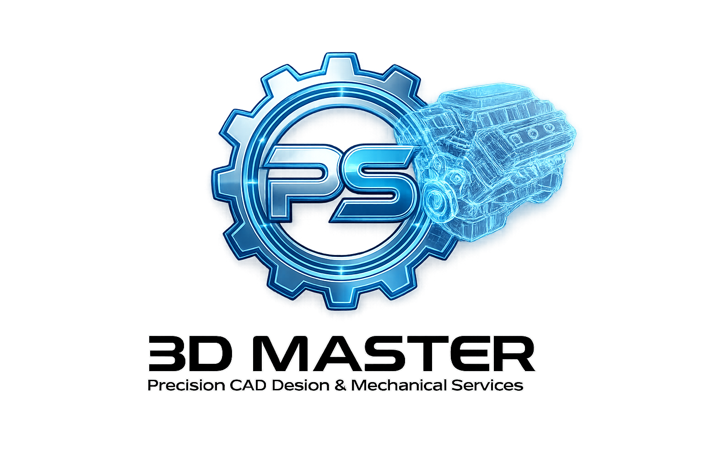

# PS3D CAD Studio



**A PS3D Master Digital Engineering Suite tool**  
Precision CAD Design & Mechanical Services  
*Engineering intelligence for precision motion systems.*

PS3D CAD Studio is an independent, original, local-first browser CAD research
project. The current repository is a working 0.2 public-release candidate:
one semantic project across Sketch, Part, Assembly, Surface, Drawing,
Electrical, Vehicle, and Automate workspaces, plus the original Master Cart
parametric component studio, a Learning Center, secure account portal, and
authenticated remote MCP transport.

It is not copied from PartMode or another CAD codebase. The project has its own
requirements, architecture, source, interface, examples, tests, provenance
record, and MIT License. Independent development reduces copyright risk but is
not a legal opinion or a patent, trademark, or freedom-to-operate clearance.

Canonical public source: [sagar25-Code-it/ps3d-cad-studio](https://github.com/sagar25-Code-it/ps3d-cad-studio).

Official PS3D Master links: [Engineering calculator](https://stepper-calculator.onrender.com/) · [Portfolio](https://sagar-portfolio-v1.vercel.app/) · [LinkedIn](https://www.linkedin.com/in/sagar-patel-1b6522100) · [Instagram @ps3dmaster](https://www.instagram.com/ps3dmaster) · [Email](mailto:sagarpatel25121995.sp@gmail.com)

## What works locally

| Workspace | Current level | Implemented subset |
| --- | --- | --- |
| Sketch | Preview | Lines, center rectangles, circles, three-point arcs, grid/snap/profile palette, construction geometry, multi-selection, visible constraint glyphs, bounded driving dimensions, stable IDs, DOF and conflict diagnostics |
| Part | Qualified + preview | Worker-qualified centered-bore manifold mesh-solid plus revisioned analytic bodies; closed annular revolve, linear pattern, datum mirror, bounded block/cylinder Unite and through-cylinder Subtract, local-Z trim, vertical-edge blend/chamfer, shell, draft, supported planar-face move/offset/replace and recognized-face delete/heal; named views, orbit/pan/zoom/fit, perspective/orthographic cameras, view box, WCS axis viewer, selection priority, and point measurement |
| 3D exchange | Preview | Local reference import for 14 scene/mesh/toolpath/point-cloud families; visible-scene export to GLB, glTF, OBJ, STL, PLY, and USDZ; PDF model package with attached GLB; U3D/PRC interactive-PDF pass-through |
| Assembly | Preview | Insert/delete box and cylinder components, edit XYZ position, hide/show, ground/release, fixed/origin/axis mate records, exploded state, deterministic transforms, conservative AABB interference candidates, original 20 ft/40 ft high-cube cargo planning frames, and a non-certified 20 ft high-cube BESS equipment arrangement |
| Master Cart | Preview | 25 original standards-oriented parametric families across fasteners, bearings/bushings, gears, chain/sprockets, timing belts/pulleys, O-rings, linear motion, hydraulic hose fittings, tube fittings, and hand tools; interactive 3D regeneration, metric/inch filters, editable material/finish/envelope fields, dimension tables, and coherent grouped Assembly insertion |
| Surface | Preview | Bicubic Bézier patch, ruled loft, editable controls, deterministic tessellation, area/boundary/normal metrics |
| Drawing | Preview | Descriptive front base view with aligned first/third-angle top and right projections; optional full section A-A and reference isometric; hidden-edge and center-line control; selective non-duplicated dimensions; user-defined general tolerances kept independent from explicit datum/position/flatness/perpendicularity inputs; A4/A3 zones, revision table, projection symbol, release-marked original title block, and SVG output |
| Electrical | Preview | Original vector component library, stable references and terminals, named pin-to-pin AC/DC/control/ground nets, automatic BESS single-line/DC auxiliary/motor-starter concepts, live structural ERC, concept BOM, SVG output, and review-gated conversion into one traceable mounting plate with DIN rails, ducts, panel-scale generic packages, terminal detail, and unsized orthogonal conductor visualization |
| Vehicle | Preview | Five original topology-specific motorcycle/scooter/EV/three-wheel packages; one authoritative SI hardpoint/member graph for 3D and orthographic projection; fork, swingarm, unit-swing and front-view wishbone state constraints; Ackermann targets; brake/tyre, road-load, operating-point and support-polygon screens; visible invariant gate; full-droop/design/full-bump states; and explicit safety boundaries |
| Automate | Preview | Twelve model-neutral local and authenticated remote MCP tools, built-in engineering-intent decomposition for parts and multi-level assemblies, machine-readable collaboration guide, experience-adapted stateless coordination agent, deterministic command finder, all-workspace Design Health analysis, scoped receipt-gated previews, OAuth/personal-token access, and a dependency-free Python client |

The 3D workspaces also provide an explicit, on-device camera hand controller.
After the user starts the camera, a dedicated same-origin Worker runs a
hash-pinned MediaPipe Hand Landmarker and returns only 21 landmarks,
handedness, confidence, and timing. Raw mirrored frames are closed immediately
inside the worker and are never stored or uploaded. Seven stable open-right-
palm frames acquire control only when the model label and mirrored wrist-index-
pinky palm chirality agree; left, ambiguous, malformed, low-confidence, and
discontinuous detections fail closed. The index fingertip moves a visible CAD
cursor without rotating the model. Touching and holding thumb and index engages
mirrored direct-manipulation orbit with 4x gain and hysteresis; releasing them
stops orbit.
In Assembly, apparent palm depth independently maps far to assembled and near
to a maximum per-component travel of 50% of the assembled scene's largest
X/Y/Z extent. Intermediate palm depth produces a smoothed partial explosion,
and one project revision is committed when motion is paused, stopped, or the
workspace is left. Camera frames stay in the current browser tab, are not
stored or uploaded, and media tracks are released on Stop, Close, or component
unmount. One-frame backpressure prevents inference queues, a One Euro filter
reduces normal jitter, and scale-aware jump rejection prevents a one-frame
background steal. Optional preview blur is visual only. The owner-supplied
photo set was used only to understand failure conditions; it was not copied,
uploaded, retained as biometric data, or used for training. This remains an
optional probabilistic input, so a live webcam smoke test and mouse/touch/
keyboard fallbacks remain required.

The public account portal supports verified-email sign-up, sign-in, sign-out,
password recovery, tab-scoped sessions, and up to five unique expiring MCP
personal tokens per user. OAuth 2.1 is the preferred connection path for
compatible AI hosts. Raw personal tokens are shown once and persisted only as
peppered HMAC digests. The Learning Center contains 12 verification-led modules
from beginner through advanced practice and generates a 15-page PDF manual from
the same reviewed source content.

The shell also provides an original color-wheel workspace system, a functional
File/Edit/Create/View/Inspect/Automate/Help menu bar, a context-sensitive top
command ribbon with project-owned inline SVG symbols, a keyboard-navigable and
workspace-filtered 341-command original CAD catalog with explicit capability
levels, a persistent
model browser with Origin/Sketches/Feature History/Bodies/revision timeline,
workspace-preserving selection, revision audit,
browser-local IndexedDB save/load, broad project
JSON, the qualified part's native revision JSON and binary STL, safe drawing
SVG, truthful capability badges, and visible diagnostics. The researched
interaction baseline and implementation matrix are in
[`docs/product/CAD_INTERACTION_ESSENTIALS.md`](docs/product/CAD_INTERACTION_ESSENTIALS.md).
The palette, command-symbol, menu, and responsive rules are recorded in
[`docs/product/UI_COLOR_AND_COMMAND_SYSTEM.md`](docs/product/UI_COLOR_AND_COMMAND_SYSTEM.md).
The exact exchange format matrix, unit rules, PDF boundary, and security model are
in [`docs/product/3D_EXCHANGE_AND_PDF.md`](docs/product/3D_EXCHANGE_AND_PDF.md).
The Master Cart families, grouped assembly semantics, supplier-reference
boundary, engineering exclusions, and brand contract are in
[`docs/product/MASTER_CART_PARAMETRIC_LIBRARY.md`](docs/product/MASTER_CART_PARAMETRIC_LIBRARY.md).
The automatic view, dimension, general-tolerance, datum, and GD&T review boundary is
in [`docs/product/AUTOMATIC_DRAWING_AND_TOLERANCE.md`](docs/product/AUTOMATIC_DRAWING_AND_TOLERANCE.md).
The nominal container templates, non-certified BESS arrangement boundary,
electrical data model, circuit templates, ERC, and engineering exclusions are in
[`docs/product/CONTAINER_BESS_AND_ELECTRICAL.md`](docs/product/CONTAINER_BESS_AND_ELECTRICAL.md).
The generic electrical-panel catalog, ECAD↔MCAD trace model, conductor-path
boundary, stale-link behavior, and MCP confirmation contract are in
[`docs/product/ELECTROMECHANICAL_REALIZATION.md`](docs/product/ELECTROMECHANICAL_REALIZATION.md).
The vehicle templates, SI conventions, visible equations, three-wheel support
model, MCP boundary, qualification exclusions, and research-source index are in
[`docs/product/VEHICLE_ENGINEERING.md`](docs/product/VEHICLE_ENGINEERING.md).
The combined 31-role PS Code Hub persona roster, six extended PS3D specialist
roles, truthful credential boundary, task-routing model, and review loop are in
[`docs/PS_CODE_HUB_AI_TEAM.md`](docs/PS_CODE_HUB_AI_TEAM.md).
The deterministic workspace-health matrix, real associativity map, rebuild
review order, repair queue, scoring rules, and release boundary are in
[`docs/product/DESIGN_HEALTH_AND_REBUILD.md`](docs/product/DESIGN_HEALTH_AND_REBUILD.md).

Only the centered-bore part path is marked `qualified`. All other functional
workbench capabilities are marked `preview`. Exact general B-rep/NURBS,
freeform Boolean and constraint solvers, persistent arbitrary-face naming, trimming/sewing,
STEP/IGES/DWG/DXF exact conversion, native proprietary CAD, production drawing
PDF certification, shared cloud CAD-document collaboration, automatic electrical sizing,
protection coordination, arc-flash/compliance analysis,
manufacturer-accurate automatic electrical packages, conductor/harness sizing,
qualified vehicle multibody/tyre/FEA/thermal/crash simulation, homologation,
and live-browser MCP control are unavailable. Remote authenticated MCP is a
stateless Preview transport: it accepts explicit bounded values and returns
JSON or a new project copy; it does not take over the open CAD tab. See
[`docs/product/PRD_PHASE_1_WORKBENCH_PREVIEW.md`](docs/product/PRD_PHASE_1_WORKBENCH_PREVIEW.md)
for the exact contract and exclusions.

## Run and verify

Prerequisites are Node.js 24 or newer and pnpm 11.9.0. Every package version
is exact and lock-to-inventory reconciliation is an executed test/build gate.

```powershell
pnpm install --frozen-lockfile --ignore-scripts
pnpm peers check
pnpm typecheck
pnpm test
pnpm build
pnpm dev
```

Vite prints the local browser URL. `pnpm test` runs the typed package suite,
the real MCP stdio client/server exchange, dependency reconciliation, and both
source-identity gates. `pnpm build` additionally rejects the Node-only MCP SDK,
Manifold candidate, WASM, and dynamic evaluation from the browser graph and
verifies static-host security policy and bundled notices.
The included GitHub workflows repeat typecheck, evidence, build, CodeQL, and
dependency-review gates in clean hosted runners.

## Connect an MCP host

For a deployed instance, use the HTTPS endpoint shown at `/access`:

```text
https://your-ps3d-domain.example/api/mcp
```

Prefer automatic OAuth 2.1 discovery. If a host supports custom HTTP headers
but not OAuth, create one scoped, expiring `ps3d_mcp_...` personal token at
`/access`; never put the web password in MCP configuration. The full remote
configuration, scope, error, and safe-command guide is in
[`docs/MCP_CONNECTION_GUIDE.md`](docs/MCP_CONNECTION_GUIDE.md).

The local stdio server remains available for approved local hosts. It is
stateless and uses the same bounded tool semantics:

It reads no project file, environment secret,
browser profile, operating-system credential, or network resource. Each call
supplies its complete bounded project and receives a result.

```powershell
pnpm mcp:build
node apps/mcp-server/dist/apps/mcp-server/src/server.js
```

Build once, then configure the host to launch Node directly. This keeps stdout
reserved for newline-framed MCP JSON rather than package-manager build output.
Example host adapter after cloning, installing, and building:

```json
{
  "mcpServers": {
    "ps3d": {
      "command": "node",
      "args": ["apps/mcp-server/dist/apps/mcp-server/src/server.js"],
      "cwd": "<absolute-path-to-ps3d-repository>"
    }
  }
}
```

The server supports modern MCP `2026-07-28` discovery and 2025-era legacy
initialization over local stdio. Start with `ps3d_guide`, then call
`ps3d_agent_handshake` to configure a stateless host-AI/PS3D working contract,
experience-level explanation depth, and correction feedback. Use
`ps3d_plan_engineering_intent` for any new part, assembly, product, or drawing:
it converts the ordinary request into reusable definitions, ordered features,
standards/evidence questions, semantic interfaces, dependency packages, and
approval gates without asking the user to paste a master prompt or claiming
geometry execution. Use
`ps3d_find_commands` to map a plain-language goal to a bounded recipe without
executing it. The twelve tools are `ps3d_guide`, `ps3d_agent_handshake`,
`ps3d_plan_engineering_intent`, `ps3d_find_commands`,
`ps3d_capabilities`, `ps3d_inspect_project`, `ps3d_design_health`,
`ps3d_analyze_vehicle`, `ps3d_electromechanical_catalog`,
`ps3d_preview_electromechanical`, `ps3d_preview_operation`, and
`ps3d_apply_preview`.
Circuit-to-3D preview
resolves only the project-owned generic catalog and returns an exact operation
plus receipt; it does not apply the result or control a live browser session.
Apply accepts only a matching SHA-256 preview receipt plus `confirmed: true`,
returns a new project, and writes no external state. The confirmation flag is a
host assertion rather than cryptographic proof of human review, and the receipt
is an integrity checksum rather than a signature. External calls do not control
the open browser project: a host supplies a complete project value, then the
user reviews and opens or imports the returned copy. The complete connection,
command-namespace, and safety contract is in
[`docs/AI_COLLABORATION.md`](docs/AI_COLLABORATION.md). The Vercel remote
transport adds HTTPS authentication, scope filtering, strict Origin handling,
a 1 MB request cap, and per-identity rate limits without storing project
payloads.

Python 3.11+ can use the project-owned standard-library client under
[`sdk/python`](sdk/python). The caller explicitly supplies the command, working
directory, in-memory project/operation, receipt, and confirmation. The client
uses `shell=False`, contains no network code, performs no automatic file or
secret discovery, and is documented in
[`docs/PYTHON_LINKING.md`](docs/PYTHON_LINKING.md). Its real process exchange is
deferred to a personal or IT-approved development/CI environment.

## Architecture, evidence, and screenshots

The semantic project and revision history are authoritative. Worker/kernel,
tessellated preview, SVG, and Three.js state are disposable derived artifacts.
The architecture is documented in
[`docs/architecture/PHASE_1_WORKBENCH_ARCHITECTURE.md`](docs/architecture/PHASE_1_WORKBENCH_ARCHITECTURE.md),
with decisions in [`docs/adr`](docs/adr).

The browser-review screenshots, including the reviewed top-ribbon, feature-
history, 3D Exchange Center, imported reference, PDF workflow, layered
vehicle-engineering layouts, and Design Health Center, are
under [`docs/screenshots`](docs/screenshots). Local
qualification evidence is recorded in `docs/PHASE_1_LOCAL_EVIDENCE.md`.
The current command/MCP verification matrix, executed browser checks, and
truthful unavailable boundaries are recorded in
[`docs/COMMAND_MCP_VERIFICATION.md`](docs/COMMAND_MCP_VERIFICATION.md).
Dependencies and assisted material are deny-by-default and recorded in
[`provenance`](provenance); no key, token, `.env` file, private path, user data,
or copied CAD asset belongs in the repository.

## Deployment status

`vercel.json` defines the hardened Vite deployment and Web-standard API
functions. Supabase owns identity; the migration stores only token hashes and
aggregate rate counters. The exact free-tier setup, environment boundaries,
live verification, and incident controls are in
[`docs/PUBLIC_DEPLOYMENT.md`](docs/PUBLIC_DEPLOYMENT.md), with the blocking
release review in [`docs/RELEASE_CHECKLIST.md`](docs/RELEASE_CHECKLIST.md).
Provider free tiers have quotas and are not a promise of unlimited or
permanently free service.

## License

Original project material is licensed under the MIT License. Third-party
components retain their own licenses and notices. See `LICENSE`,
`THIRD_PARTY_NOTICES.md`, `INDEPENDENT_DEVELOPMENT.md`, and
`provenance/SOURCE_POLICY.md`.
