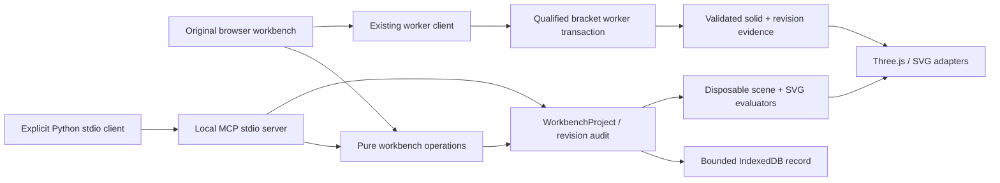

# Phase 1 Broad Workbench Architecture

**Date:** 2026-08-19  
**Status:** Approved for local preview implementation

## Architecture decision

PS3D will expand as an original modular browser workbench around the existing
semantic document and worker-qualified centered-bore evaluator. Broad
capabilities use a second, versioned `WorkbenchProject` semantic model and
project-owned pure evaluators. They are marked `preview` until each can move
behind the worker transaction/evidence boundary with its own numerical
contract.

This is a deliberate staged architecture, not a hidden claim that tessellated
previews are exact CAD geometry.

## Modules

### `packages/workbench-core`

Owns the broad semantic schema, exact validation, default original project,
capability matrix, 76-record command catalog, stable operation types, revision
application, audit records, and project summaries. It has no browser, Node,
rendering, or MCP dependency.

### `packages/workbench-sketch`

Owns bounded sketch entity creation, snapping, supported constraint records,
selection helpers, bounds, and an explainable DOF/conflict estimate. It does
not claim to be a general nonlinear constraint solver.

### `packages/workbench-geometry`

Owns deterministic assembly primitive scenes, transforms, interference
candidates, bicubic Bézier evaluation, ruled-loft tessellation, finite-mesh
validation, and preview metrics. All coordinates use millimeters at this
preview boundary and convert explicitly at renderer edges.

### `packages/workbench-drawing`

Owns safe SVG generation from bounded part parameters. It uses fixed original
templates, XML escaping, finite coordinates, deterministic decimal formatting,
and no external images, scripts, links, or embedded HTML.

### `packages/viewport-three`

Owns disposable 3D camera, scene, ray-picking, selection-filter, and measurement
presentation. It exposes named orientation, perspective/orthographic projection,
navigation mode, grid/axis visibility, and view-state callbacks. It never owns
semantic project identity or durable modeling operations.

### `packages/workbench-mcp`

Owns MCP-neutral tool definitions and pure call handlers. The Node stdio entry
uses the official SDK, but call semantics remain project-owned and testable
without transport. Calls accept and return bounded data only.

### `apps/studio-web`

Owns React presentation, workspace routing, user confirmation, local save/load,
file downloads, command search, viewport lifecycle, and accessibility. Domain
operations remain in packages.

### `apps/mcp-server`

Owns a local stdio transport entry. It exposes no file or network tool and
holds no cross-call project state. The host supplies a project on each call.

### `sdk/python`

Owns an optional Python 3.11+ standard-library MCP stdio client. The caller
supplies explicit argv and working directory. The client uses `shell=False`, a
small non-secret runtime environment allowlist, finite request timeouts, and no
network or project-file discovery. It is executed only in an approved external
development or CI environment.

## Capability truth model

Every visible capability has one of three levels:

- `qualified`: crosses the existing worker validation, evidence, persistence,
  and independent mesh checks for its declared envelope;
- `preview`: a functional, bounded semantic and tessellated implementation with
  tests, but not exact or release-qualified;
- `unavailable`: visible only to communicate the boundary; invoking it returns
  `UNSUPPORTED_CAPABILITY`.

The status appears in the UI, project capability resource, MCP tool output,
documentation, and test fixtures.

## Revision and transaction rules

1. A workbench operation includes a stable operation ID, expected revision,
   kind, and bounded payload.
2. Exact retry returns the same accepted projection; operation-ID reuse with a
   different payload fails.
3. The pure evaluator validates a candidate and returns an immutable next
   project plus changed IDs and a human-readable summary.
4. The browser persists the complete validated broad project record to
   IndexedDB before reporting a manual save.
5. MCP preview never mutates. It returns normalized operation, changed IDs,
   summary, next revision, and a SHA-256 receipt over the canonical preview.
6. MCP apply requires the same project revision, operation, receipt, and
   `confirmed: true`; it returns a new project and does not write anywhere.

The MCP confirmation field is a second server-side guard, not proof of human
intent. MCP hosts must still show their own tool-approval UI. The browser's
Automate workspace shows the diff and requires a local confirmation click.

## Sketch numerical boundary

- Coordinates are finite millimeters in `[-10,000, 10,000]`.
- Snap tolerance is a visible project setting from 0.01 through 10 mm.
- Entity count is at most 500; constraint count at most 1,000.
- Lines shorter than 0.01 mm, circles below 0.01 mm radius, and degenerate arcs
  fail.
- Supported constraints reduce a documented estimate of scalar freedom. Rank
  is not inferred for unsupported constraint graphs.
- Bounded line length, rectangle width/height, and circle radius edits update
  geometry and one dimension record atomically. Other driving dimensions remain
  unavailable.
- Pair constraints are validated records used by the freedom estimate; they do
  not claim general nonlinear solution or automatic geometry movement.
- Conflicting fixed coordinates and incompatible equality/radius values are
  reported; the prior project remains valid.

## Part boundary

The existing bracket engine remains SI/f64, serial-worker, 96-segment bore,
closed/oriented/manifold, single component, genus one, and independently
validated. Broad feature records beyond that engine are preview metadata and
derived scenes only.

Viewport camera orientation, projection, navigation mode, display aids,
selection priority, and measure points are session state rather than project
geometry. Measure coordinates come from visible triangle-ray intersections in
world coordinates. Body/component filtering is supported; face/edge filtering
is disabled until persistent topology references exist.

## Assembly boundary

- At most 100 instances and 200 mates; hierarchy depth at most 16.
- Instances use deterministic translation plus XYZ Euler preview rotation.
- Box/cylinder insertion, component deletion with dependent-mate repair, XYZ
  translation, visibility, and grounding are revisioned atomic operations.
- Fixed, origin-coincident, and aligned-axis mates are supported.
- The solver applies ordered direct transforms; it is not an optimization or
  dynamics engine.
- Interference candidates use axis-aligned bounding boxes and are labeled
  conservative; exact collision is unavailable.

## Surface boundary

- Bicubic Bernstein basis with a 4 × 4 finite control net.
- Ruled loft with two equal-count section profiles.
- Tessellation 4–48 segments on each parameter direction.
- Triangle winding, finite coordinates, normal variation, approximate area,
  and boundary edges are checked.
- No trim curves, NURBS weights/knots, sewing, offsets, exact intersections, or
  surface-solid conversion.

## Drawing boundary

- SVG only; fixed A4/A3 layouts and original title block.
- Front, top, right, and illustrative isometric projection of the bounded part.
- Dimensions reflect current semantic parameters but are not a standards
  conformance claim.
- Generated SVG contains only a fixed allowlist of vector/text elements and
  attributes. User note text is escaped and length-bounded.

## MCP protocol boundary

- Official MCP TypeScript SDK 2.0.0 and Zod 4.4.3 are pinned only after exact
  dependency/license/integrity inventory is updated.
- Local transport: stdio. Streamable HTTP is not exposed in this phase.
- Tool list ordering is deterministic; tools declare read-only, destructive,
  idempotent, and open-world hints accurately.
- No resources, prompts, sampling, tasks, roots, network, filesystem, process
  execution, browser profile, environment secret, or external side effect.
- Stdout is reserved for MCP. The server bounds each call to 1 MB equivalent
  structured input and maps expected failures to `isError: true` results.

The design follows the current official MCP specification and SDK documentation
recorded in `provenance/RESEARCH_SOURCES.md`; protocol compatibility is proven
by an executing client/server test rather than inferred from file presence.

## Security and recovery

- Existing CSP, no-remote-connect policy, worker failure restart, exact native
  schemas, and production dependency boundary remain.
- Broad project imports are exact, count-bounded, finite, and versioned.
- File download names are fixed; imported names never become paths.
- IndexedDB failure leaves in-memory state visible and reports that durability
  was not achieved.
- A malformed preview receipt, stale revision, unknown operation, unsupported
  capability, or invalid geometry returns a typed failure with no mutation.

## Qualification sequence

1. Pure package tests and project/MCP schema fuzz boundaries.
2. Typecheck and production graph enforcement.
3. MCP executing transport test.
4. Browser workflows for all eight workspaces plus reload/save/rollback.
5. Accessibility and console-error review.
6. Dependency, license, vulnerability, secret, private-path, and reproducible
   build checks.
7. User screenshot review.
8. Separate public-release review and action.
